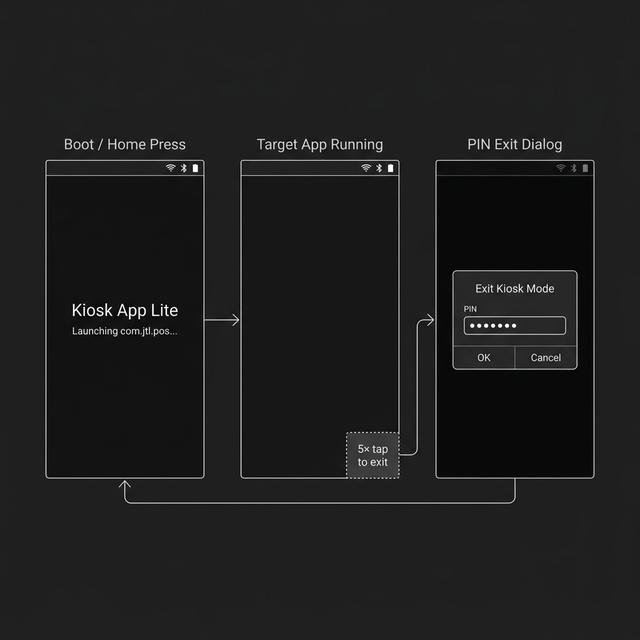

# Kiosk App Lite

[](https://github.com/mhmdgazzar/kiosk-app-lite/releases/latest/download/kiosk-app-lite-v1.0.0.apk)
[](LICENSE)
[](https://developer.android.com)

A minimal, open-source **Android** kiosk launcher that locks a device to a single app. Built for POS terminals, kiosks, digital signage, and any scenario where you need to restrict an Android device to one application.

**No root. No Device Owner. No trial. No watermark. Just works.**

## Features

| Feature | Description |
|---|---|
| <picture><source media="(prefers-color-scheme: dark)" srcset="docs/icons/light/lock-simple.svg"><source media="(prefers-color-scheme: light)" srcset="docs/icons/dark/lock-simple.svg"></picture> **Single-App Lock** | Automatically launches and locks the device to your chosen app |
| <picture><source media="(prefers-color-scheme: dark)" srcset="docs/icons/light/arrow-counter-clockwise.svg"><source media="(prefers-color-scheme: light)" srcset="docs/icons/dark/arrow-counter-clockwise.svg"></picture> **Auto-Relaunch** | If the app closes or crashes, it relaunches within 3 seconds |
| <picture><source media="(prefers-color-scheme: dark)" srcset="docs/icons/light/rocket-launch.svg"><source media="(prefers-color-scheme: light)" srcset="docs/icons/dark/rocket-launch.svg"></picture> **Boot Auto-Start** | Launches the target app immediately after device boot |
| <picture><source media="(prefers-color-scheme: dark)" srcset="docs/icons/light/wifi-high.svg"><source media="(prefers-color-scheme: light)" srcset="docs/icons/dark/wifi-high.svg"></picture> **Quick Settings Access** | Status bar remains accessible for WiFi/Bluetooth toggles |
| <picture><source media="(prefers-color-scheme: dark)" srcset="docs/icons/light/key.svg"><source media="(prefers-color-scheme: light)" srcset="docs/icons/dark/key.svg"></picture> **PIN-Protected Exit** | Exit kiosk mode via hidden gesture + PIN code |
| <picture><source media="(prefers-color-scheme: dark)" srcset="docs/icons/light/terminal-window.svg"><source media="(prefers-color-scheme: light)" srcset="docs/icons/dark/terminal-window.svg"></picture> **ADB Configuration** | Change target app and PIN remotely via ADB — no rebuild needed |
| <picture><source media="(prefers-color-scheme: dark)" srcset="docs/icons/light/shield-check.svg"><source media="(prefers-color-scheme: light)" srcset="docs/icons/dark/shield-check.svg"></picture> **ADB-Safe** | Does NOT use Device Owner/Admin — ADB always remains accessible |
| <picture><source media="(prefers-color-scheme: dark)" srcset="docs/icons/light/package.svg"><source media="(prefers-color-scheme: light)" srcset="docs/icons/dark/package.svg"></picture> **Tiny Footprint** | ~1.6 MB APK, minimal resource usage |

## <picture><source media="(prefers-color-scheme: dark)" srcset="docs/icons/light/android-logo.svg"><source media="(prefers-color-scheme: light)" srcset="docs/icons/dark/android-logo.svg"></picture> Android Compatibility

| Android Version | API Level | Supported |
|---|---|---|
| Android 6.0 Marshmallow | API 23 | ✅ |
| Android 7.0–7.1 Nougat | API 24–25 | ✅ Tested |
| Android 8.0–8.1 Oreo | API 26–27 | ✅ |
| Android 9 Pie | API 28 | ✅ |
| Android 10 | API 29 | ✅ |
| Android 11 | API 30 | ✅ |
| Android 12–12L | API 31–32 | ✅ |
| Android 13+ | API 33+ | ✅ |

> **Minimum:** Android 6.0 (API 23) &nbsp;·&nbsp; **Target:** Android 12 (API 32)
>
> Tested on **Sunmi T2** POS terminal (Android 7.1.1). Works on any Android device — tablets, phones, POS terminals, digital signage displays.

## <picture><source media="(prefers-color-scheme: dark)" srcset="docs/icons/light/monitor.svg"><source media="(prefers-color-scheme: light)" srcset="docs/icons/dark/monitor.svg"></picture> UI Wireframe

The kiosk operates in a simple 3-state flow:

<p align="center">
  
</p>

| State | Description |
|---|---|
| **Boot / Home Press** | Brief transition screen shown when device boots or user presses Home. Immediately launches the target app. |
| **Target App Running** | The locked app runs fullscreen. Status bar stays accessible for WiFi/Bluetooth. The bottom-right corner is the hidden exit zone. |
| **PIN Exit Dialog** | After 5 quick taps in the bottom-right corner, a PIN dialog appears. Correct PIN exits kiosk mode. |

## <picture><source media="(prefers-color-scheme: dark)" srcset="docs/icons/light/rocket-launch.svg"><source media="(prefers-color-scheme: light)" srcset="docs/icons/dark/rocket-launch.svg"></picture> Quick Start

### 1. Download

[**Download the latest APK →**](https://github.com/mhmdgazzar/kiosk-app-lite/releases/latest/download/kiosk-app-lite-v1.0.0.apk)

Or install via ADB:

```bash
adb install -r kiosk-app-lite-v1.0.0.apk
```

### 2. Set as Default Launcher

Press the **Home** button on the device. Android will ask you to choose a launcher:
- Select **"Kiosk App Lite"**
- Tap **"Always"**

The target app will launch immediately.

On **first launch**, a clean settings screen will appear where you can configure the target app and exit PIN.

### 3. Configure the Target App

Use the built-in **Settings UI** (shown on first launch), or configure remotely via ADB:

```bash
adb shell am broadcast -a com.sunmikiosk.launcher.SET_TARGET \
  --es package "com.your.app.package" \
  -n com.sunmikiosk.launcher/.ConfigReceiver
```

Then reboot the device or press Home to apply.

### 4. Change the Exit PIN

Default PIN is `1234`. To change it:

```bash
adb shell am broadcast -a com.sunmikiosk.launcher.SET_PIN \
  --es pin "9999" \
  -n com.sunmikiosk.launcher/.ConfigReceiver
```

## <picture><source media="(prefers-color-scheme: dark)" srcset="docs/icons/light/sign-out.svg"><source media="(prefers-color-scheme: light)" srcset="docs/icons/dark/sign-out.svg"></picture> Exiting Kiosk Mode

1. **Tap 5 times quickly** in the **bottom-right corner** of the screen
2. A PIN dialog will appear
3. Enter the PIN (default: `1234`)
4. Kiosk mode is disabled — you return to the normal Android home screen

## <picture><source media="(prefers-color-scheme: dark)" srcset="docs/icons/light/wrench.svg"><source media="(prefers-color-scheme: light)" srcset="docs/icons/dark/wrench.svg"></picture> Build from Source

### Prerequisites
- Java JDK 11+ (or 17)
- Android SDK with platform 32

### Build

```bash
git clone https://github.com/mhmdgazzar/kiosk-app-lite.git
cd kiosk-app-lite
chmod +x gradlew
./gradlew assembleDebug
```

The APK will be at `app/build/outputs/apk/debug/app-debug.apk`.

### Install

```bash
adb install -r app/build/outputs/apk/debug/app-debug.apk
```

## <picture><source media="(prefers-color-scheme: dark)" srcset="docs/icons/light/tree-structure.svg"><source media="(prefers-color-scheme: light)" srcset="docs/icons/dark/tree-structure.svg"></picture> Architecture

```
app/src/main/java/com/sunmikiosk/launcher/
├── KioskActivity.java      # Main launcher — launches & monitors the target app
├── SettingsActivity.java    # Clean settings UI (target app, PIN)
├── BootReceiver.java        # Starts kiosk on device boot
└── ConfigReceiver.java      # ADB-configurable target app & PIN
```

### How It Works

1. `KioskActivity` registers as an Android **HOME launcher** via the manifest
2. On launch, it immediately starts the configured target app
3. When the user presses Home or Back, Android returns to `KioskActivity` (the default launcher), which immediately relaunches the target app
4. A background `Handler` checks every 3 seconds if the kiosk screen is visible — if so, it relaunches the target app
5. The status bar is left fully accessible so users can toggle WiFi, Bluetooth, etc.

### Why No Device Owner?

Many kiosk apps require `dpm set-device-owner`, which gives them system-level control. This is dangerous because:
- It can **disable USB debugging**, locking you out of ADB
- It **cannot be easily removed** — often requires a factory reset
- It grants **excessive permissions** for a simple kiosk use case

Kiosk App Lite takes a deliberately simpler approach: it's just a launcher. It doesn't need — and doesn't request — any special permissions beyond `RECEIVE_BOOT_COMPLETED`.

## <picture><source media="(prefers-color-scheme: dark)" srcset="docs/icons/light/git-merge.svg"><source media="(prefers-color-scheme: light)" srcset="docs/icons/dark/git-merge.svg"></picture> Contributing

Contributions are welcome! Feel free to open issues or submit pull requests.

## <picture><source media="(prefers-color-scheme: dark)" srcset="docs/icons/light/scales.svg"><source media="(prefers-color-scheme: light)" srcset="docs/icons/dark/scales.svg"></picture> License

This project is licensed under the [MIT License](LICENSE).

---

*Built for [Sunmi T2](https://www.sunmi.com/) POS terminals, but works on any Android device.*
